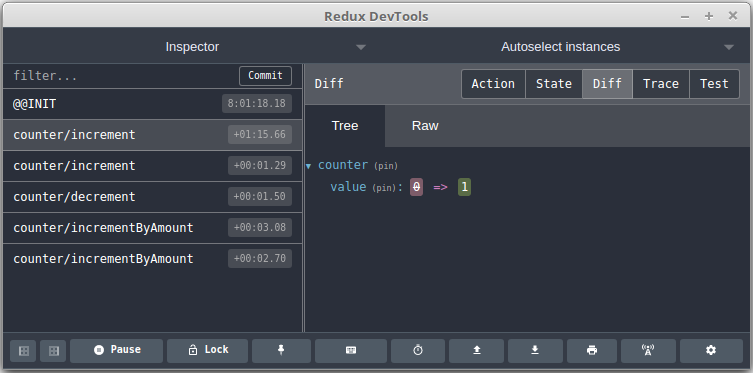
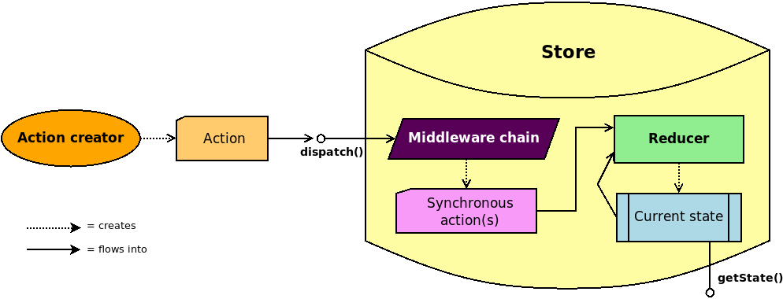

<style>
section {
  display: flex;
  justify-content: flex-start;
  background-image: url("./PurpleYoga.jpg");
  background-size: 200% 110%;
  color: #350557;
}

h1,
h2,
h3,
h4,
h5,
h6 {
  color: #350557;
}

section.title {
  display: flex;
  flex-direction: column;
  align-items: center;
  justify-content: center;
  background-size: 125% 110%;
}

section.title h1 {
  font-size: 3em;
}

section.title h2 {
  font-size: 2em;
}

section.title h3 {
  font-size: 1.5em;
}

section.title:after {
  color: #350557;
}

blockquote {
  quotes: "«" "»" "«" "»";
  border: none;
  text-align: center;
  color: #350557;
  margin-bottom: 1em;
}

blockquote p {
  display: inline;
  font-weight: bold;
  font-size: 1.2em;
  line-height: 1.25em;
  vertical-align: middle;
}

blockquote:before {
  content: open-quote;
}

blockquote:after {
  content: close-quote;
}

pre {
  background: papayawhip;
}

section:after {
  color: #350557;
  font-weight: bold;
}

section.title:after {
  display: none;
}

footer {
  display: none;
}

section:not(.title) img {
  margin-left: auto;
  margin-right: auto;
  display: block;
  padding: 50px;
  border-radius: 40px;
  border: 4px solid black;
}

section.gitHub {
  display: flex;
}

section.gitHub p {
  margin-top: 3em;
  font-size: 2em;
  flex: 1;
  text-align: center;
}

a,
  a:active,
  a:visited {
    color: #350557;
    font-weight: bold;

    text-decoration: underline;
  }

</style>

<!-- _class: title -->

<style scoped>
  footer {
    display: block;
    color: #350557;
    font-style: italic;
  }
</style>

<!-- footer: "Latest update: 2020-10-24"  -->

### Gianluca Costa [:butterfly:](https://gianlucacosta.info/)

# Introduction to Redux

## with TypeScript

---

## Foreword

**Elegance always matters** - especially when _crafting software_ - and _patterns_ exist precisely as _inspiring principles_ that lead us to _methodically tackling complexity_ and creating _clean architectures_.

**State management** is one of the most essential and nuanced problems in the IT domain - and **Redux**, inspired by _Elm_ and _Flux_, elegantly mixes beautiful concepts such as _events_ and _reducers_ to provide _a simple and effective solution_ via a _functional approach_.

---

# About this presentation

Our journey stems from my passion for the concepts at the heart of Redux: we are going to discover, _with no claim of completeness_, how Redux can be _a brilliant tool for state management_ - especially when combined with the _static type checking_ provided by **TypeScript**.

I have also created a few _minimalist code projects_ - available in the [companion GitHub repository](https://github.com/giancosta86/intro-to-redux) - to showcase different aspects of the Redux ecosystem.

This work is designed to be _a concise reference_: should you need a more gradual approach, _live coding sessions_ or real-life projects, please consider _online courses_.

For the latest and most complete version of the documentation, please refer to
_Redux's official website_.

---

# Overview

The main parts of this presentation can be briefly summarized as follows:

1. **Enter Redux**: introductory considerations before sailing

1. **Essential building blocks**: core aspects of Redux, packaged in **redux** on NPM

1. **Redux Toolkit**: _simplified development_ with the **@reduxjs/toolkit** package

1. **React Redux**: to elegantly combine React and Redux

1. **Conclusion**: parting thoughts

---

<!-- _class: title -->

### Part 1

## Enter Redux

---

# What is Redux?

> Redux is a pattern and library for _managing_ and _updating_ _application state_

- _Minimalist library_ providing just a core implementation

- Redux _does not depend on a specific major library or framework_, such as React or Angular: it can be referenced by _any JavaScript project_, potentially even simple CLI apps

- The ecosystem provides _a wide variety of extensions_ and _developer tools_

---

# Global state in one store

The core idea is a **single, centralized store** containing the _global state_:

- **Any modification** to the state can only be performed _indirectly_, by **sending messages** to the store.

- Each message is processed according to specific _business rules_ and **creates a new state** for the store.

---

# Why use Redux?

- **Single source of truth** - the store
- **Trackable** modifications
- **Expressive** code
- **Scalable**, _message-based_ architecture
- **Simplified data access** in complex UIs
- **Time-travel debugging**

---

# Time-travel debugging

<style scoped>

img {
  border: none;
  padding: 0;
}
</style>



---

# Vibrant ecosystem

- The very heart of Redux consists of the **redux** package, designed to be _extensible_

- **Redux Toolkit**, packaged as **@reduxjs/toolkit**, exports sensible defaults and minimalist constructs

- **React Redux** provides seamless integration with **React**.

- **Redux DevTools**: time-travelling debugger and other tools

...and much more! Redux is designed to be _extensible_!

---

# Not every app needs Redux

_Every architectural choice has drawbacks_; in the case of Redux:

- _boilerplate code_ to support the architecture - especially without Redux Toolkit

- additional _layers of indirection_

- developers must _choose what part of the state is global_ - typically in React apps

- the _learning curve_, which could be initially demanding

---

# Best scenarios for Redux

The more of the following factors are present in your application, the more effective Redux will be:

- **Multiple, heterogeneous sources** triggering state updates

- **Chaotic state fragmentation** at different levels

- **Complex**, strongly **domain-related** update logic

- **Message-/Event-driven** architecture

- **Vast, shared** codebase

---

<!-- _class: title -->

### Part 2

## Essential building blocks

---

# The architecture at a glance



---

<!-- _class: title -->

### Section 2.1

## Store, actions, reducers

---

# The store

> The store is an object that holds the application's state tree. There should only be one single store in a Redux app

The store provides just a basic set of methods - in particular:

- **getState()**: returns _the current state_

- **dispatch(action)**: sends an **action** (a message) to the store, always triggering the computation of the next state. _There's no other way_ to change the state in the store

- **subscribe(listener)**: _adds a listener_ that gets notified right after the computed _next state_ becomes the store state. Returns a function to cancel the subscription

---

# The state must be serializable

The state contained in the store can range from a primitive value up to _a complex object graph_ having arbitrary depth.

One should store only _serializable objects_ as well as primitive values - to ensure portability in a variety of situations such as persistence and debugging. In particular, the state should definitely **not** contain:

- **class instances**
- functions
- promises

It is usually recommended that **entities** - i.e., domain objects having an ID, be stored in a dedicated state branch and _referenced by ID from within other branches_.

---

# Store creators

> A store creator is a function that creates a Redux store

The essential store creator is **createStore()**, provided by Redux and supporting 3 args:

- **reducer**: the reducer (also known as **root reducer**) used by the store - _a function returning the new state_ whenever an action is dispatched

- **initial state** (optional): if missing or set to _undefined_, the reducer will use the default value of its _state_ parameter

- **enhancer** (optional): higher-order function that takes a _store creator_ and returns a modified _store creator_; the most common enhancer is **applyMiddleware()**, to apply _middleware_ extensions

---

# Just a single store?

> It is _possible_ to create multiple distinct Redux stores, but the intended pattern is to have only a single store

Considering that the Redux ecosystem revolves around the **one-store principle**, _it is generally advisable to adhere as much as possible to this guideline_.

---

# Actions

> An action is a plain object that represents an intention to change the state

Actions can be _arbitrary JavaScript objects_, with just one requirement: _they **must** have a **"type"** field_, that should be a specific string (not a symbol), such as in:

```typescript
const ADD_BEAR = "bears/add"

interface AddBearAction {
  type: typeof ADD_BEAR
  name: string
}
```

As shown above, **type** constants often has "/" characters to _conventionally_ organize the actions into logical trees; however, Redux code is usually based on mere _string equality_

---

# Action creators

> An action creator is a function creating a specific action type

An **action creator** is conventionally the _only_ way to create an action - as it ensures that _the action's fields are correctly initialized_.

This is a typical pattern for creating the action seen in the previous slide:

```typescript
export function addBear(name: string): AddBearAction {
  return {
    type: ADD_BEAR,
    name
  }
}
```

---

# Feature-related action type

It is recommended to define a dedicated type _unifying all the interfaces related to the same set of actions in the domain_; for example:

```typescript
type BearAction = AddBearAction | ClearBearsAction
```

---

# Reducers

> A reducer is a pure function that receives the current store state and an action, and must return the new state

Reducers are **pure functions** - _they cannot have side effects_. In particular:

- reducers **cannot modify their arguments** - especially _the state_

- reducers **cannot depend on the context** - e.g, reading/writing _global variables_

- reducers **cannot perform side-effects** (deleting files, calling impure functions, ...)

- reducers **cannot contain async logic** - such as REST API calls

- reducers must be **deterministic** they cannot rely on any external environment or even _random number generators_ or **Date.now()** - use _action creators_ for that

---

# Writing a basic reducer

```typescript
export function bearReducer(
  state: ReadonlyArray<Bear> = [], //The default arg is the initial state
  action: BearAction //This is why we have defined the BearAction type
): ReadonlyArray<Bear> {
  //A switch is frequent, but not mandatory
  switch (action.type) {
    case ADD_BEAR:
      return [...state, { name: action.name }]

    case CLEAR_BEARS:
      return []

    default:
      //You must return the current state by default
      return state
  }
}
```

---

# The principle of state immutability

> Redux expects that all state updates are done immutably

**Never** perform - in plain Redux and plain TS - something like this within a reducer:

```typescript
state.myField = 90
```

- Instead, to change one or more fields, you must **create a new object** holding the state - for example, via the _spread syntax_

**State immutability** provides a wide range of benefits, such as:

- **code safety**: no _unexpected state modifications_

- **performances**: Redux is based on _shallow equality checking_

---

# Redux basics in action

<!-- _class: gitHub -->

Please, refer to the [GitHub project](https://github.com/giancosta86/intro-to-redux/tree/master/src/core/basic)

---

# Combining reducers

The store demands _exactly one reducer_ - named **root reducer**; however, dealing with a huge, monolithic state within a single function would be rather inconvenient

> You split the root reducer into multiple, independent _sub-reducers_ - each operating on different parts of the state object

This can be achieved in many ways - and mainly via the **combineReducers()** function:

```typescript
const rootReducer = combineReducers({
  bears: bearReducer,
  rangers: rangerReducer
})
```

---

# Understanding reducer combination

<style scoped>
p {
  margin: 0.2em;
}
</style>

Whenever a compound reducer is called, the following logical steps occur:

1. it receives _the current state and the dispatched action_

1. _it creates a new object_ having the same fields as the object passed to **combineReducers()**:

   1. each sub-reducer is called _with the value of the related field_ in the compound state - but also _with the action passed to the compound reducer_

   1. _the result of each sub-reducer_ is assigned _to its related field_ in the new object

1. _The return value_ of the compound reducer will be:

   - **the new object** - _if_ at least one sub-reducer returns _a different reference_

   - **the current state** otherwise

---

# One action, potentially multiple effects

In the previous example:

- **bearReducer()** computes the value for the **bears** field of the state

- **rangerReducer()** computes the value for the **rangers** field of the state

Despite this output differentiation, _each reducer_ receives _every single dispatched action_; consequently:

> Different reducers can react to the same action type

For example, different parts of the domain model could react differently to the same global event.

---

# Where should the business logic reside?

- **In action creators**:

  - **+**: traditionally easier approach for beginners

  - **-**: actions become _thick objects_ with _duplicated business logic_

  - **-**: the effects of action creators _are not affected by time-travel debugging_

- **In reducers** (recommended):

  - **+**: _single source of truth_ for computations

  - **+**: _pure functions_ foster _code robustness_

---

# Setters and events

In Redux, one dispatches **actions** - that are, technically speaking, _messages_.

In _semantic terms_, however, messages can be _interpreted_ as:

- **setters** - like _"bears/add"_ - that describe _commands to be executed_ by the system

- **events** - like _"bears/added"_ - which denote _something that already happened_ and that might trigger business logic within the system

_Redux is technically unopinionated_, and different architectural styles might have different visions - not to mention _a hybrid approach_: what matters is _to be aware of the semantic distinction_.

---

# Selectors

> Selectors are _pure functions_ that know how to extract specific pieces of information from the store state

```typescript
function getBearNames(state: ReadonlyArray<Bear>): ReadonlyArray<string> {
  return state.bears.map((bear) => bear.name)
}
```

Selectors are essential in terms of _minimalist design_, as they:

- prevent _duplicated domain logic_ in different parts of the system

- can express _calculated properties_, thus preventing _redundant data_ in the store

**Memoization** libraries like **reselect** can remarkably enhance selector performances.

---

<!-- _class: title -->

### Section 2.2

## Middleware

---

# Middleware alters the dispatch process

> Middleware provides a third-party extension point between dispatching an action, and the moment it reaches the reducer

In particular, middleware:

- exists _for the lifetime of the store_

- _can see all dispatched actions_ and **dispatch actions by itself**

- can _customize the dispatch process_

---

# Async actions

**Async actions** are _action instances that are not serializable_ - and would not be accepted by a reducer: for example, a function, or a Promise.

> Async action _can_ be dispatched - but only _serializable actions_ should enter the reducer

More precisely, it is the _middleware chain_ that _detects async actions_ and _dispatches actions accordingly_.

---

# Middleware in detail

> A middleware is a higher-order function that composes a dispatch function to return a new dispatch function

The **redux** package exports two fundamental type definitions:

- ```typescript
  type MiddlewareAPI = { dispatch: Dispatch; getState: () => State }
  ```

  represents a _minimalist view_ of the store - with just **dispatch()** and **getState()**

- ```typescript
  type Middleware = (api: MiddlewareAPI) => (next: Dispatch) => Dispatch
  ```

Middleware needs to be _plugged into the store_: by design, you can only do so when creating the store - by passing the list of middlewares to **applyMiddleware()**.

---

# Applying middleware

One of the first problems with Redux is **logging**: in particular, _store subscribers can only access the store state_, not the actions.

The solution is _to apply middleware when creating the store_ - e.g. via **redux-logger**:

```typescript
import { createStore, applyMiddleware } from "redux"
import { createLogger } from "redux-logger"

const logger = createLogger({...}) //One can pass a variety of options

const reducer = ...

export const createCustomStore = () => createStore(
  reducer,
  applyMiddleware(logger)
)
```

---

# Redux core - extended example

<!-- _class: gitHub -->

Please, refer to the [GitHub project](https://github.com/giancosta86/intro-to-redux/tree/master/src/core/extended)

---

# Middleware in the ecosystem

- **Advanced reducers**: reduce-reducers, redux-ignore, reduxr-scoped-reducer

- **Sophisticated listening**: redux-watch, redux-subscribe, ...

- **Asynchronous actions**: Redux Thunk, Redux-Saga, ...

- **Action batching**: redux-batched-actions, redux-batch

- **Subscription**: redux-batched-subscribe

- **Logging**: redux-logger, redux-log-slow-reducers

- **Debugging**: Redux DevTools

---

# Creating middleware

_Creating one's custom middleware_ via a _factory method_ is actually fairly straightforward - especially when using curried notation for lambdas:

```typescript
import { MiddlewareAPI, Dispatch, Action, Middleware } from "redux"

export function createCustomMiddleware<
  TAction extends Action
>(/*Custom params used to create the middleware*/): Middleware {
  //This series of chained lambdas represents the middleware
  return (store: MiddlewareAPI) => (next: Dispatch<TAction>) => (
    action: TAction
  ) => {
    //TODO: Add here the actual code of the middleware
    //Call next(action) to pass the action to the next mw in the chain.
    //You can also call store.dispatch() with any new action.
  }
}
```

---

# Custom middleware in action

<!-- _class: gitHub -->

Please, refer to the [GitHub project](https://github.com/giancosta86/intro-to-redux/tree/master/src/merry-dispatcher)

---

<!-- _class: title -->

### Part 3

## Redux Toolkit

---

# Effective minimalism

> Redux Toolkit makes it easier to write good Redux applications and speeds up development, by baking in our recommended best practices, providing good default behaviors, catching mistakes, and allowing you to write simpler code

- It is available as a package via NPM: **@reduxjs/toolkit**.

---

<!-- _class: title -->

### Section 3.1

## Enhanced store and middleware

---

# Battery-included store

Redux Toolkit provides an enhanced store creator - **configureStore()**, taking an options object having the following core fields:

- **reducer**: can be either a reducer or the object that would be passed to **combineReducers()**

- **preloadedState**: optional initial state

- **devTools** - enables/disables/configures **Redux DevTools** _in development only_:

  - if **true** (the default), **Redux DevTools** will have a predefined configuration

  - if a **DevToolsOptions** instance, it will be used to configure Redux DevTools

---

# Middleware in bundle

Redux Toolkit's **configureStore()** automatically applies middleware to the new store - especially **Redux Thunk**; additionally, _development_ and _production_ have different default lists of applied middleware.

Middleware can be customized by passing another field to **configureStore()**'s options:

- **middleware** - which can be:

  - _an array of middleware_ - in lieu of calling **applyMiddleware()**

  - _a higher-order function_, taking the **getDefaultMiddleware()** function and returning an array of middleware instances - if you want to _add_ middleware to the default list

---

# Composable and efficient selectors

Redux Toolkit exports **createSelector()** - actually provided by the **reselect** package.

To create a selector, you can:

- just define it as a function **(state) => T**, with arbitrary **T**

- use **createSelector()**, which takes:

  - _an array of source selectors_, defined in either way - ensuring **composability**

  - a function _whose arguments will be the **actual** return values of the sources_ and that _must compute the selector's value_

  This kind of compound selectors relies on _memoization_ for **efficiency**: the value returned by a compound selector _stays the same as long as so do the sources_.

---

<!-- _class: title -->

### Section 3.2

## Simplified actions and reducers

---

# Simplified action creators

**createAction<TPayload>(type: string, [prepare])** _returns an action creator_ with:

- **toString()**: the action type - so, _there is no more need for separate string constants_

- **match(action)**: _true_ if the action type matches - very useful in type guards

Furthermore, this action creator returns a **PayloadAction<TPayload>** - an interface extending **Action** and having the additional **payload** field - _standardizing action payloads_ all over Redux Toolkit.

---

# Generating a custom payload

The _prepare_ argument in **createAction()** is optional:

- if **prepare** is _omitted_, the action creator _takes just one argument_ - defined by the **TPayload** type argument of **createAction()**

  - _if the type argument is omitted as well_, it defaults to **undefined** - and _the action creator will take no argument_

- otherwise, **prepare** must be a function taking _any argument list_ and returning an object of type **{payload: TPayload}** - where **TPayload** is arbitrary

  The actual creator will automatically add the **type** field.

---

# createAction() in action

<!-- _class: gitHub -->

Please, refer to the [GitHub project](https://github.com/giancosta86/intro-to-redux/tree/master/src/toolkit/utils/createAction.test.ts)

---

# Simplified and flexible reducers

**createReducer(initialState, (builder) => {})** simplifies the implementation of a _reducer_ via _a fluent builder_ in lieu of the traditional **switch** construct.

A few aspects are definitely worth noting:

- the very _action creators_ produced by **createAction()** should be the **case** argument of **builder.addCase(case, (state[, action]) => state)**: this _ensures type checking for each function passed as the second argument_

- **Each subreducer can modify the state!** Because **createReducer()** internally uses the **Immer** library to actually manipulate _a proxy wrapped around the state_

- a **default case** _can_ be specified via the builder, but it is not mandatory - _the current state is returned by default_

---

# createReducer() in action

<!-- _class: gitHub -->

Please, refer to the [GitHub project](https://github.com/giancosta86/intro-to-redux/tree/master/src/toolkit/utils/createReducer.test.ts)

---

<!-- _class: title -->

### Section 3.3

## Slices

---

# Creating a slice

**createSlice()** is _the simplest and most elegant way_ to create both the _actions_ and the _reducer_ for a branch of the state - replacing also **createAction()** and **createReducer()**:

```typescript
const bearSlice = createSlice({
  name: "bears", //The prefix for all the related action types
  initialState: [{name: "Yogi"}],
  reducers: {
    //This creates both the action creator and the related reducer case
    bearAdded(state: Bear[], action: PayloadAction<string>) { //The action is optional
      state.push({name: action.payload}) //Fake mutability via Immer
    }

    bearsCleared(state: Bear[]) {
      state.length = 0
    }
  }
})
```

---

# Exporting from a slice

Once you have created a slice within a module, you can _export both the action creators and the overall reducer_:

```typescript
export const { addBear, clearBears } = bearSlice.actions

export const bearReducer = bearSlice.reducer
```

- The action creators can be imported and called as usual

- The reducer takes into account the cases declared within the slice and _can in turn become a sub-reducer_ passed to a combining function such as **combineReducers()**

---

# Decoupled action creator and reducer in a slice

You can actually decouple the action creator and the reducer in a slice as well:

```typescript
type AddBearPayload = {name: string, token: number}
(...)
reducers: {
  addBear: {
    //This works just like prepare in createAction()
    prepare: (name: string) => {
      //As usual, you definitely mustn't specify the "type" field here
      return { payload: { name, token: DateTime.now() } }
    },

    //This works just like a case in createReducer()
    //Static typing ensures that action is PayloadAction<BearCreatedPayload>
    reducer: (state, action) => {
      state.push({name: action.name})
    }
}
```

---

# Extra reducers

In slices, _each reducer acts like a switch case applied to its specific action type_, because of the coupling with action creators provided by **createSlice()**.

However, a slice might need to logically handle actions whose creators are not defined in the slice itself.

The options passed to **createSlice()** can have another, optional field, **extraReducers**: its value must be a lambda taking just a **builder** which works like in **createReducer()**.

Ultimately, both **reducers** and **extraReducers** are combined into the slice's **reducer**.

---

# Slices in action

<!-- _class: gitHub -->

Please, refer to the [GitHub project](https://github.com/giancosta86/intro-to-redux/tree/master/src/toolkit/slicing)

---

<!-- _class: title -->

### Section 3.4

## Redux Thunk via Toolkit

---

# Is Redux synchronous?

By design, **Redux is synchronous**:

- you _cannot_ add asynchronous logic to reducers, as _they must be pure functions_

- you _could_ add async logic to action creators, but that is not recommended

- both the state and the action received by the reducer _must_ be serializable - so _promises and functions cannot be dispatched_

However, Redux Thunk - that **configureStore()** applies by default - _alters the dispatch process_ to support _asynchronous operations_ by **dispatching thunks**.

---

# Thunks

> A thunk is a function that wraps an expression to delay its evaluation, such as () => 42

In the case of **Redux Thunk**, a thunk is _a higher-order function receiving two arguments_, actually referencing the store methods:

- **dispatch()**

- **getState()**

You usually return thunks from **thunk creators** - functions whose arguments customize the thunk behavior.

---

# Dispatching thunks

_Dispatching a thunk runs its code_, which can include:

- _reading the current state_ of the store

- _dispatching actions_ or even _other thunks_

- performing one or more **await**, if the thunk is an **async** function

The body of the thunk is arbitrary - and it is executed as soon as it is dispatched.

---

# Typical thunk workflow

Most often, async operations follow a dedicated pattern:

1. **Dispatch an action notifying that the operation is _pending_**: this usually alters the state so that the application's view displays some _Waiting..._ component

1. _Perform arbitrary operations_, that might also involve **await** on promises

1. Finally, **dispatch an action notifying**:

   - The **success** of the operations - with the related payload, which is usually _the result of the computation process_

   - The **failure** of the operations - maybe with the related error

   In both cases, _the UI is updated accordingly_.

---

# Simplified thunk creation

When TypeScript's static type checking is enforced, even the implementation of _a basic pattern_ for asynchronous operations via Redux Thunk can become _exponentially cumbersome_.

Consequently, Redux Toolkit exports the **createAsyncThunk()** function to define a **thunk creator**, which in turn creates a thunk that:

- executes _an arbitrary block of code_ - the actual logic, encapsulated within a Promise

- keeps track of the _async action lifecycle_ by dispatching the related actions - **pending**, **fulfilled**, **rejected** - all sharing the same prefix

---

# Using createAsyncThunk()

**createAsyncThunk()**, in a fairly basic form, takes the following arguments:

- the **type prefix** shared by the 3 workflow actions

- a **factory function** - whose optional arguments are:

  - **arg**: the argument that could be passed to the thunk creator

  - **thunkAPI** - object with essential APIs such as **dispatch()** and **getState()**

_The thunk creator returned by the function has 3 properties_ - **pending**, **fulfilled** and **rejected** - that reference the _action creators_, as returned by **createAction()**, of the lifecycle actions - so they can be used in reducer cases.

---

# Thunks in action

<!-- _class: gitHub -->

Please, refer to the [GitHub project](https://github.com/giancosta86/intro-to-redux/tree/master/src/toolkit/async)

---

# The return value of dispatch()

The **dispatch()** method provided by the store _dispatches actions to the middleware chain and ultimately to the reducer_ - but its return value has interesting properties:

- by default, **dispatch() returns the dispatched action**

- however, _if middleware is applied to the store_, **dispatch() returns the value returned by the middleware**

  - in particular, when using **Redux Thunk** combined with **createAsyncThunk()**, **dispatch() returns the Promise returned by the thunk** - consequently, one can use **await** on its return value within an **async** function

---

<!-- _class: title -->

### Part 4

## React Redux

---

# One-way data flow

**One-way data flow** is a paradigm adopted by both React and Redux:

- in _Redux_, via the _immutability_ of the current state, plus the **dispatch()** mechanism

- in _React_, information flows via _properties_ from a component to its sub-components

React's _waterfall approach_ actually works - but it has a major drawback: if a node holds data that are required in a remote descendant, _such data must be passed to all the intermediary node as well_.

This is an inelegant but fairly infrequent scenario, although there may be more compelling reasons to adopt Redux, so:

> Don't use Redux until you have problems with vanilla React

---

# Introducing React Redux

> React Redux is the official Redux UI binding library for React

The very essence of React Redux is:

- **subscribing to the store** created by Redux

- **updating the UI**:

  - _only **when** needed_ - that is, if the state actually changes

  - _only **where** needed_ - to minimize DOM modifications

---

# Where should the state reside?

When Redux is added to a React app, _there are at least 3 possible locations_ where each piece of the app state can reside:

- **global state** - provided by the Redux store:

  - it can be modified only by _dispatching actions_ to the store

  - data can be extracted from it via _selectors_

  As the name implies, it is best suited for app-wide global information

- **component state** - living within the single React component and provided, for example, by the **useState()** hook. Typically recommended for _form controls_

- **context state** - an intermediate state container provided by React

---

# Components: connected or presentational?

> When a React component interacts with the Redux store, it becomes a _connected component_

Not all components need to be connected: on the contrary, _most React components_ should be **presentational** - that is, relying just on their properties and maybe their internal state.

Consequently, in React Redux it is common to see _connected components that fetch data from the Redux store and propagate such data to their sub-tree of presentational components_.

---

# Plugging the Redux store into React

React Redux is available via NPM as **react-redux**.

After the installation, it takes just a few steps:

1. **Create the store**, as you would in vanilla Redux - for example, you can export either _the store instance_ or _a store creator_ from a dedicated module

1. **In JSX**, _plug the **Provider** tag_ - _usually as the parent of the application's root component tag_ passed to React's **render()** function - assigning the store instance to its **store** property:

   ```typescript
   <Provider store={myStore}>
     <MyReactApp />
   </Provider>
   ```

---

# Connecting components to the store

_To create a **connected** component_:

- _if the component is implemented as a class_ - which is less and less frequent, the **connect()** function is required - as well as the related boilerplate code

- _in modern, functional React components_, everything can be achieved via **hooks**:

  - **useSelector(selector)**: returns the value it calculates from the current state within the store

  - **useDispatch()** returns a reference to the store's **dispatch()** method

---

# Performance optimizations

- Calling **useSelector()** many times with different selectors _should be preferred_ over calling **useSelector()** once with an aggregating selector

  - real performance gains can be achieved via **createSelector()** - which is provided by **reselect** as well as **Redux Toolkit**

General advice also apply - for example, _in reducers it is more efficient to return the very same state instance rather than a deep copy_.

---

<!-- _class: title -->

### Part 5

## Conclusion

---

# Global takeaways

- **Do you really need Redux?** Just like any other software component, _you should adopt it in scenarios where the benefits outweigh the drawbacks_

- Use **createSlice()** to _create the action creators and the reducers_ for each slice of the domain: this will make you especially rely on **PayloadAction<T>**

- Call **configureStore()** to _create the store_ with default middleware and DevTools

- Invoke the _store methods_ - especially **dispatch()** and **getState()**

- Rely on **createAsyncThunk()** for _asynchronous operations_

- Call **useSelector()** and **useDispatch()** in React Redux for elegant code

---

# Redux projects - directory structure

_Redux is not opinionated_ in terms of directory layout, thus different choices are viable:

- **group by feature**: the recommended style, based on _Domain-Driven Design_. It seems wise to have a **bears.ts** module containing everything about _bears_:

  - _action type constants_ and _action interfaces_

  - _action creators_ (exported)

  - _reducer_ (exported)

* **group by construct**: à la Ruby on Rails - with _one folder per construct_ (**actions/**, **reducers/**, ...), each containing _a module per feature_ (**bears.ts**, **rangers.ts**, ...)

---

# Further references

<style scoped>
li {
  line-height: 1.2em;
}
</style>

- [Redux - Official website](https://redux.js.org/)

- [Redux Toolkit](https://redux-toolkit.js.org/)

- [Redux Thunk](https://github.com/reduxjs/redux-thunk)

- [Redux Saga](https://redux-saga.js.org/) - a _generator-based_ approach to async operations

- [React Redux](https://react-redux.js.org/)

- [Redux - Style guide](https://redux.js.org/style-guide/style-guide)

- [Middleware evolution](https://redux.js.org/advanced/middleware) - step-by-step architectural explanation

- [React Redux sample app](https://un8my.csb.app/)

- [Elm](https://elm-lang.org/) - _«A delightful language for reliable webapps»_

---

<!-- _class: title -->

## Thank you! ^\_\_^
